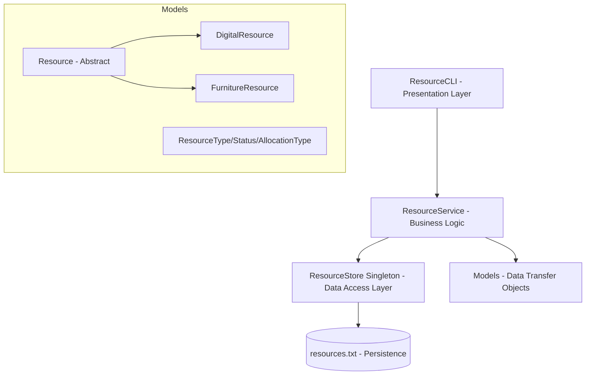

# Resource Management System (CLI)

A professional, layered Java application for managing hardware and office resources. This project demonstrates core Java principles, efficient file-based persistence, and a clean separation of concerns.

## 🚀 Key Features

- **Comprehensive CRUD Operations**: Add, update, view, and delete resources with ease.
- **Advanced Search & Sorting**: Filter resources by name or allocated user using Java Streams, and naturally sort them via `Comparable`.
- **Optimized Performance**: Leverages `HashMap` in the service layer for fast `O(1)` resource lookups.
- **Persistent Storage**: Automated data persistence to `resources.txt` using custom serialization.
- **Resource Tracking**: Manage diverse abstract resources (Digital and Furniture), allocation status, and robust exception handling.
- **User-Friendly CLI**: Interactive menu-driven interface with formatted table outputs.

## 🛠️ Tech Stack

- **Language**: Java 17+
- **Persistence**: Flat-file database (`resources.txt`)
- **API/Libraries**: 
  - `java.util.stream` for data processing.
  - `java.time` for modern date/time handling.
  - `java.io` for robust file operations.
  - `java.util.UUID` for unique resource identification.

## 🏛️ System Architecture

The project follows a **Layered Architecture** pattern to ensure maintainability and scalability.



### Components:
1.  **Presentation Layer (`ResourceCLI`)**: Handles user interaction, input validation, and data formatting.
2.  **Service Layer (`ResourceService`)**: Contains business logic, including search filtering and orchestration between storage and UI.
3.  **Storage Layer (`ResourceStore`)**: Manages low-level File I/O, serialization, and deserialization of objects.
4.  **Model Layer**: Defines the core data structures and enums used across the system.

## 🧠 Core Concepts Applied

- **Object-Oriented Programming (OOP)**: Heavy use of encapsulation, inheritance (abstract classes & subclasses), and polymorphism.
- **Design Patterns**: Implementation of the **Singleton Pattern** for `ResourceStore`.
- **Collections & Streams API**: Utilization of `HashMap` for fast lookups, `Comparable` for natural sorting, and Streams for functional processing.
- **Exception Handling**: Robust custom error handling for scenarios like resource not found.
- **Layered Pattern**: Separation of concerns between UI, Logic, and Data.
- **File Serialization**: Implementation of custom pipe-delimited (`|`) serialization for efficient data storage.

## 📂 Project Structure

```text
src/main/java/com/aayush/cli/
├── ResourceCLI.java (Main Entry)
├── models/
│   ├── Resource.java (Abstract)
│   ├── DigitalResource.java
│   ├── FurnitureResource.java
│   ├── ResourceType.java
│   ├── ResourceStatus.java
│   └── AllocationType.java
├── services/
│   └── ResourceService.java
└── storage/
    └── ResourceStore.java
```

## 🚥 Getting Started

### Prerequisites
- JDK 17 or higher
- IDE (IntelliJ IDEA, VS Code, or Eclipse)

### Compilation & Execution
1.  Navigate to the project root.
2.  Compile the source files:
    ```bash
    javac -d bin src/main/java/com/aayush/cli/**/*.java
    ```
3.  Run the application:
    ```bash
    java -cp bin com.aayush.cli.ResourceCLI
    ```

---
Developed by **Aayush** as part of the Java Programming Curriculum.
